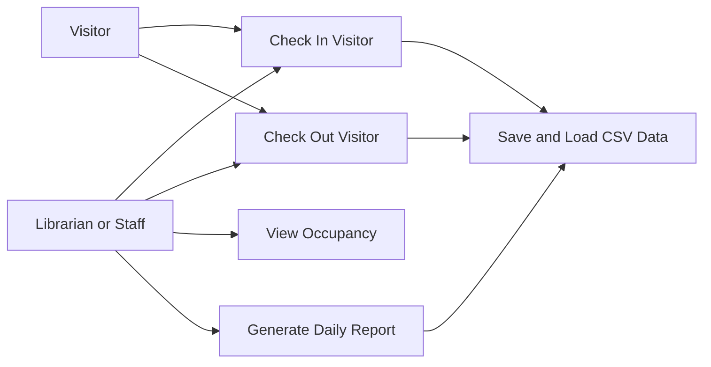
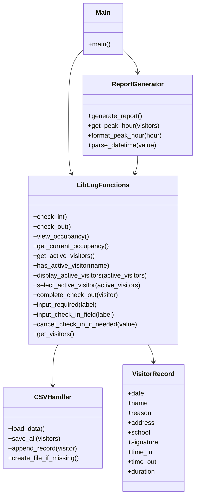
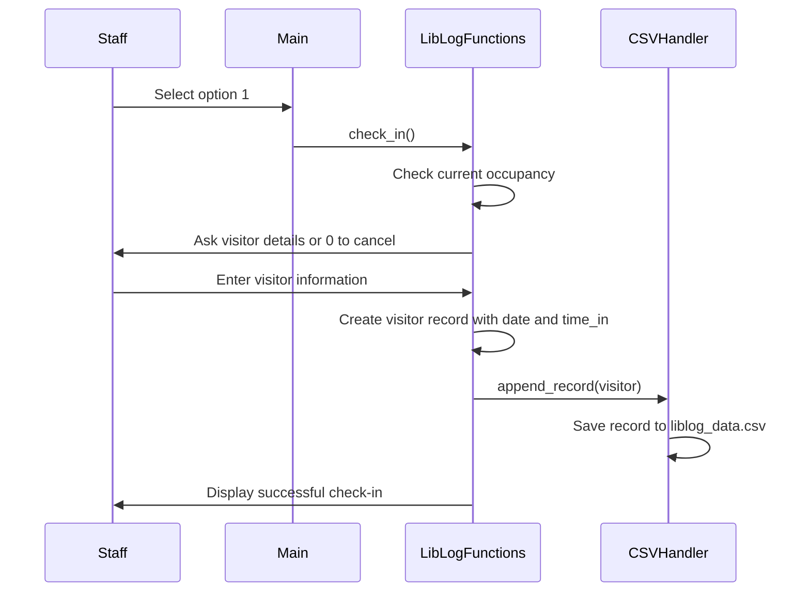
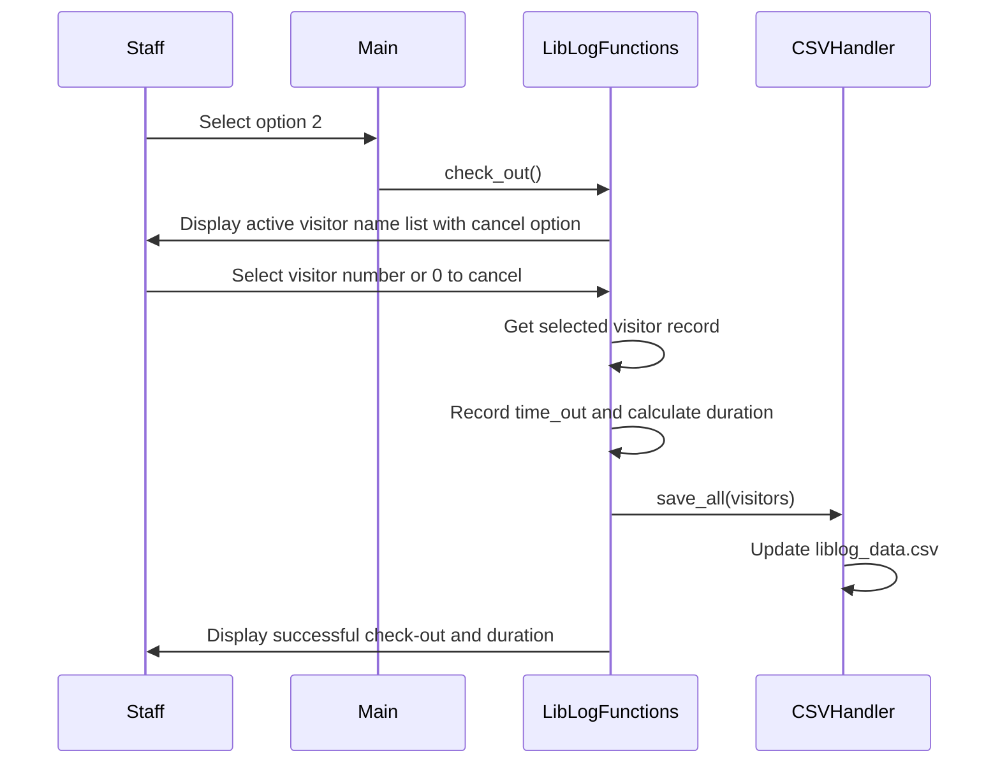
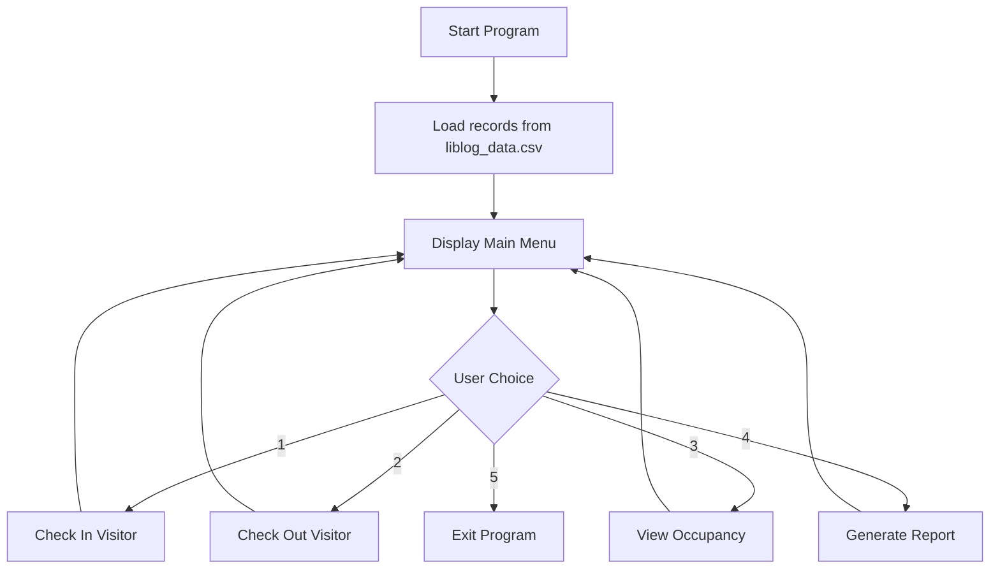

# LibLog Console System Documentation

## Introduction

LibLog Console System is a menu-driven Python program designed to record and monitor library visitors. The system allows a user to check in a visitor, check out a visitor, view the current library occupancy, and generate a daily report.

The program uses modular programming and file handling. Visitor records are stored in a CSV file named `liblog_data.csv`, which allows the system to keep data even after the program is closed. Daily reports are saved as text files inside the `reports` folder.

## Objectives

The main objectives of the system are:

1. To record visitor check-in information.
2. To record visitor check-out time and calculate visit duration.
3. To monitor live library occupancy.
4. To warn the user when the library is near or at full capacity.
5. To save all visitor records using CSV file handling.
6. To generate a daily report based on the saved records.

## Object-Oriented Analysis

Object-Oriented Analysis focuses on understanding the problem, identifying the users of the system, and identifying the important objects and actions.

### Actors

| Actor | Description |
| --- | --- |
| Librarian or Staff | Uses the system to record visitor check-ins, check-outs, occupancy, and reports. |
| Visitor | Provides personal visit information during check-in and checks out when leaving. |

### Main Use Cases

| Use Case | Description |
| --- | --- |
| Check In Visitor | Records visitor information and arrival time. |
| Check Out Visitor | Records departure time and calculates visit duration. |
| View Occupancy | Displays current occupancy, capacity, percentage full, and warning message. |
| Generate Daily Report | Creates a text report for the current day. |
| Save and Load Data | Stores records in CSV and restores records when the program starts. |

### Object Candidates

| Object | Important Data | Responsibility |
| --- | --- | --- |
| Visitor Record | Date, name, reason, address, school, signature, time in, time out, duration | Stores one visitor transaction. |
| Library Log System | Visitor list, maximum capacity | Manages check-in, check-out, and occupancy. |
| CSV Storage | File name, field names | Saves and loads visitor records. |
| Report Generator | Daily records, peak hour, average duration | Creates daily report summary. |

### Functional Requirements

1. The system shall display a main menu.
2. The system shall allow a visitor to check in.
3. The system shall require the visitor's full name, reason, address, school, and digital signature.
4. The system shall automatically record the date and time in.
5. The system shall save check-in records to `liblog_data.csv`.
6. The system shall provide a cancel option during check-in.
7. The system shall prevent a visitor from being checked in twice while still inside.
8. The system shall allow a visitor to check out by selecting from a numbered list of active visitor names.
9. The system shall provide a cancel option during check-out.
10. The system shall automatically record time out and calculate duration.
11. The system shall update the CSV file after check-out.
12. The system shall display current occupancy and maximum capacity.
13. The system shall generate a daily report as `report_YYYY-MM-DD.txt`.

### Non-Functional Requirements

1. The system should be simple and easy to use through a console menu.
2. The system should keep data even after the program closes.
3. The system should separate code into modules for easier maintenance.
4. The system should prevent empty required inputs.
5. The system should prevent check-in when maximum capacity is reached.

## Object-Oriented Design

Object-Oriented Design focuses on how the system is organized and how each part works together. The current program is implemented using Python modules and functions. For documentation purposes, the modules can be represented as design components.

### Module Design

| Module | Purpose |
| --- | --- |
| `Main.py` | Displays the menu and calls the selected system function. |
| `liblog_function.py` | Contains the main features such as check-in, check-out, and occupancy display. |
| `csv_handler.py` | Handles CSV file creation, loading, saving, and appending records. |
| `report_generator.py` | Creates the daily report file. |

### Data Design

Each visitor record is stored as a dictionary and saved as one row in the CSV file.

| Field | Description |
| --- | --- |
| `date` | Date of visit. |
| `name` | Full name of the visitor. |
| `reason` | Reason for visiting the library. |
| `address` | Exact location or address of the visitor. |
| `school` | Name of the visitor's school. |
| `signature` | Typed name used as digital signature. |
| `time_in` | Automatic check-in timestamp. |
| `time_out` | Automatic check-out timestamp. |
| `duration` | Total time spent inside the library. |

### Process Design

When the program starts, it loads visitor records from `liblog_data.csv`. The main menu is then displayed. The user chooses an option, and the system calls the appropriate function. During check-in, the user may enter `0` at any prompt to cancel before the visitor record is saved. New check-in records are appended to the CSV file only after all required fields are completed. Before saving a new check-in, the system checks if the same visitor name is already active for the day to avoid doubled active records. During check-out, the system displays a numbered list of visitor names currently inside and the user selects the visitor to check out or enters `0` to cancel. Check-out records update the existing visitor data and rewrite the CSV file. Reports are generated from the current day's records.

## UML Diagrams

### Use Case Diagram



### Class or Module Diagram



### Check-In Sequence Diagram



### Check-Out Sequence Diagram



### System Flowchart



## Program Methods and Functions

### `Main.py`

| Function | Description |
| --- | --- |
| `main()` | Displays the menu, gets the user's choice, and calls the selected feature. |

### `liblog_function.py`

| Function | Description |
| --- | --- |
| `clear_screen()` | Clears the console screen. |
| `get_today()` | Returns the current date. |
| `is_today(visitor)` | Checks if a visitor record belongs to the current day. |
| `get_current_occupancy()` | Counts visitors who checked in today and have not checked out. |
| `get_active_visitors()` | Returns today's visitors who are still inside the library. |
| `has_active_visitor(name)` | Checks if a visitor name is already checked in and prevents doubled active records. |
| `input_required(label)` | Keeps asking for input until the user enters a non-empty value. |
| `input_check_in_field(label)` | Gets a required check-in field and allows `0` to cancel the process. |
| `cancel_check_in_if_needed(value)` | Stops the check-in process when the user enters `0`. |
| `check_in()` | Records a visitor's information, timestamp, and saves the record to CSV. |
| `display_active_visitors(active_visitors)` | Displays a numbered list of visitor names currently inside and a cancel option. |
| `select_active_visitor(active_visitors)` | Lets the user choose the visitor to check out by number or cancel by entering `0`. |
| `complete_check_out(visitor)` | Records time out, calculates duration, and updates the CSV file. |
| `check_out()` | Displays active visitors, lets the user select one, and completes the check-out process. |
| `view_occupancy()` | Displays current occupancy, capacity, percentage full, and warning status. |
| `get_visitors()` | Returns the list of visitor records loaded in memory. |
| `get_max_capacity()` | Returns the maximum capacity of the library. |

### `csv_handler.py`

| Function | Description |
| --- | --- |
| `create_file_if_missing()` | Creates `liblog_data.csv` with headers if it does not exist. |
| `load_data()` | Loads all records from the CSV file when the program starts. |
| `save_all(visitors)` | Rewrites the CSV file after a record is updated. |
| `append_record(visitor)` | Adds one new visitor record to the CSV file. |
| `_normalize_row(row)` | Makes sure each CSV row has all required fields. |

### `report_generator.py`

| Function | Description |
| --- | --- |
| `parse_datetime(value)` | Converts a timestamp string into a datetime object. |
| `is_today(visitor, today)` | Checks if a visitor record is for the current report date. |
| `format_peak_hour(hour)` | Converts the peak hour into a readable time range. |
| `get_peak_hour(visitors)` | Finds the hour with the highest number of check-ins. |
| `generate_report()` | Creates and saves the daily report. |

## Instructions for Running the Program

1. Open the project folder.
2. Make sure Python is installed on the computer.
3. Run the program using this command:

```powershell
python Main.py
```

4. Choose from the menu:

```text
1. Check In Visitor
2. Check Out Visitor
3. View Occupancy
4. Generate Report
5. Exit
```

5. During check-in, enter the visitor's full name, reason of visit, address, school, and digital signature, or enter `0` at any prompt to cancel.
6. During check-out, select the visitor number from the displayed active visitor name list, or enter `0` to cancel.
7. To view current occupancy, choose option 3.
8. To create the daily report, choose option 4.

## Methodology

The system was developed using Python and a modular programming approach. The development process followed these steps:

1. Identify the main requirements of a library visitor log system.
2. Design a menu-driven console interface.
3. Create separate modules for menu control, system functions, CSV handling, and report generation.
4. Use dictionaries to represent visitor records.
5. Use a list to store visitor records while the program is running.
6. Use CSV file handling to save records permanently.
7. Use the `datetime` module to automatically record time in and time out.
8. Calculate occupancy by counting today's visitors without a time out.
9. Generate a daily report from the stored visitor data.
10. Test the system by performing check-in, check-out, occupancy display, and report generation.

## Results

After implementation, the system was able to perform the required features successfully.

### Check-In Result

The system accepts visitor information and saves it to `liblog_data.csv`. The user can enter `0` at any check-in prompt to cancel without saving a partial record.

Example output:

```text
===== CHECK-IN =====
Enter 0 anytime to cancel check-in.

Check-in successful!
Date: 2026-05-27
Time In: 2026-05-27 08:15:30
Current Occupancy: 1
```

Example cancelled check-in:

```text
===== CHECK-IN =====
Enter 0 anytime to cancel check-in.
Full Name: 0

Check-in cancelled.
```

### Check-Out Result

The system displays the names of visitors currently inside, allows the user to select a visitor by number or enter `0` to cancel, records the departure time, calculates duration, and updates the CSV file.

Example output:

```text
Visitors Currently Inside:
--------------------------
1. Juan Dela Cruz
2. Maria Santos
0. Cancel check-out
--------------------------

Enter your choice: 1

Check-out successful!
Name: Juan Dela Cruz
Time Out: 2026-05-27 09:05:12
Duration: 0:49:42
Current Occupancy: 0
```

### Occupancy Result

The system displays the current number of visitors inside the library.

Example output:

```text
Current Occupancy: 16
Maximum Capacity: 20
Percentage Full: 80.00%
WARNING: Library is NEAR CAPACITY!
```

### Daily Report Result

The system generates a daily report file inside the `reports` folder.

Example report:

```text
===== LIBLOG DAILY REPORT =====
Date: 2026-05-27

Total Check-ins: 5
Peak Hour: 08:00 - 08:59
Average Visit Duration: 45.20 minutes
Visitors Still Inside: 2
Completed Visits: 3
```

## Conclusion

The LibLog Console System successfully records visitor check-ins and check-outs, monitors library occupancy, saves data using CSV file handling, and generates a daily report. The use of modules makes the program easier to understand, maintain, and improve in the future.

Possible future improvements include adding visitor ID numbers, search and edit features, login security, database storage, and a graphical user interface.
